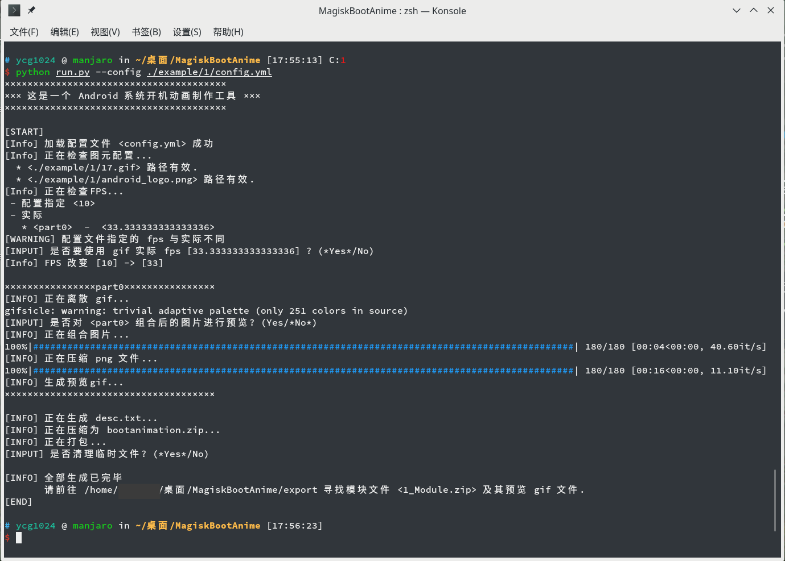

# BootAnimationMaker -- Android 系统开机动画 Magisk 模块制作工具

将图片 (png，jpg...)、动图 (gif) 组合制作 Android 系统开机动画，并将其打包成 Magisk 模块的工具

## 运行环境

### Python 及 Python 库依赖

请保证 **Python >= 3.7**，因为使用了 dataclass 等新特性，3.7以下的版本运行会报错

```auto
pillow   >= 5.3.0
tqdm     >= 4.28.1
requests >= 2.20.1
colorama >= 0.4.1
click    >= 7.0
pyyaml   >= 3.13
```

请检查这些依赖，或使用 `pip install -r requirements.txt` 安装这些依赖

### 其他依赖

本脚本还使用了 [gifsicle](https://www.lcdf.org/gifsicle/)、[pngquant](https://pngquant.org/) 等第三方软件，请根据平台不同使用相应的方法安装软件包

* Linux

  使用包管理器安装 `gifsicle`、`pngquant`

* Windows

  `gifsicle`、`pngquant` 为了方便已被默认包含到 `bin` 文件夹下，不须另行安装，如欲更换版本，则务必保证 `gifsicle.exe`、`pngquant.exe` 与当前的路径结构相同

* Mac

  暂时不支持，由于没有 Mac 设备，无法进行测试，欢迎 `pull requests`

## 使用方法

下载本脚本并解压或使用 `git clone`

在脚本文件夹打开 Terminal（PowerShell）

准备图片素材，建议将其放置到脚本文件夹下的某一子文件夹中，在其中新建 `config.yml` 文件，其格式参考 `config_template.yml`

然后运行 `run.py`

```sh
python run.py # 默认配置文件的路径为 "./config.yml"

# 或使用 `--config` 指定路径

python run.py --config xxxxx
```

参考例子见 `example` 文件夹，以 `example/1` 为例，运行

```sh
python run.py --config ./example/1/config.yml
```



> 注意：`config.yml` 文件中的图片路径若为相对路径，则默认为相对于运行环境的相对路径，建议使用绝对路径以避免出错。

## 成品展示

> **声明**：图中素材均来源于互联网，仅供技术测试与展示使用，请勿商用，如有侵权请联系我删除
> **Copyright Statement**: All the materials in the picture are from the Internet. They are only for technical testing and display. Please do not use them for any commercial purpose. If there is any infringement, please contact me to delete.

<table>
    <tr>
        <td><center>Animation 1 </center></td>
        <td><center>Animation 2</center></td>
        <td><center>Animation 3</center></td>
        <td><center>Animation 4</center></td>
    </tr>
</table>

<table>
    <tr>
        <td><center>Animation 5 part 0</center></td>
        <td><center>Animation 5 part 1</center></td>
        <td><center>Animation 6 part 0</center></td>
        <td><center>Animation 6 part 1</center></td>
    </tr>
</table>

## 兼容性

原理上能兼容大部分的机型，由于我手头只有一加和小米的设备，只在一加和小米上测试通过，但据说三星的设备与其他设备的目录结构不一致，我没有进行过测试，因此不建议三星的用户使用本脚本做的动画。

## Q&A

1. 为什么使用 Magisk

对于大部分机型而言，原理上只需要替换系统 `/system/media/bootanimation.zip` 文件就可以实现开机动画的自定义，但之所以使用 Magisk，一是方便管理，随时可以更换和卸载，二是考虑到安全，不会因为意外情况造成无法开机的惨剧，建议在安装本脚本生成的开机动画模块之前（事实上应该在安装任何模块之前），先安装 [mm（Magisk Manager for Recovery Mode）](https://github.com/Magisk-Modules-Repo/mm)模块，这样在无法开机时就可以在 TWRP 中通过命令行手动删除有问题的模块。

1. `bootanimation.zip` 的格式

> 绝大部分翻译自这里 [https://android.googlesource.com/platform/frameworks/base/+/master/cmds/bootanimation/FORMAT.md](https://android.googlesource.com/platform/frameworks/base/+/master/cmds/bootanimation/FORMAT.md)

```txt
desc.txt - 一个文本文件（描述动画的构成）
part0  \
part1   \  包含每帧 PNG 文件的文件夹
...     /
partN  /
```

**`desc.txt` 的格式**

文件的第一行是动画的常规参数：

```txt
WIDTH HEIGHT FPS
```

* WIDTH: 动画的宽 (像素)
* HEIGHT: 动画的高 (像素)
* FPS: ，每秒播放的帧(张)数, 比如 60

接下来是如下格式的几行（每个 part 一行）：

```txt
TYPE COUNT PAUSE PATH [#RGBHEX [CLOCK1 [CLOCK2]]]
```

* TYPE: 一个字符来表示这是什么类型的动画片段 (p、c)
  * p -- 这个部分将播放，除非被开机结束事件打断
  * c -- 这个部分将一直播放到底，无论开机状态是什么样的
* COUNT: 这部分动画将播放多少次，0代表一直循环播放直到开机结束
* PAUSE: 这一部分结束后，将暂停多少帧(张)的时间
* PATH: 动画帧的目录 (比如说 part0、part1)
* RGBHEX: (-)
* CLOCK1, CLOCK2: (-)

有一点要注意，如果多段动画的第一段参数为为 `c 0 0`，则动画在收到开机完毕的事件后，不会马上结束，而是会完成本次播放，接着如果有后续动画，则会继续播放后续动画

1. Magisk模块中 `module.prop` 的设置。

> 参考自 [https://topjohnwu.github.io/Magisk/guides.html#magisk-module-template](https://topjohnwu.github.io/Magisk/guides.html#magisk-module-template)

`module.prop` 文件的格式如下:

```config
id=<string>
name=<string>
version=<string>
versionCode=<int>
author=<string>
description=<string>
minMagisk=<int>
```

* `id` 必须符合正则表达式: `^[a-zA-Z][a-zA-Z0-9\._-]+$`. 例如: ✓ a_module, ✓ a.module, ✓ module-101, ✗ a module, ✗ 1_module, ✗ -a-module. 这是这个模块的唯一识别码，一旦发布就不能更改。
* `versionCode` 必须是一个整数，这个整数被用于比较版本。
* `minMagisk` 一个整数用于设置最小 Magisk 版本，新模块应该设置为17000。
* 其他没有提到的项目可以为任意字符串行

欲修改 `module.prop` 只需要在 `config.yml` 中修改 `module_prop_conf` 中对应项即可

## license

[Apache Licnese 2.0](LICENSE)


